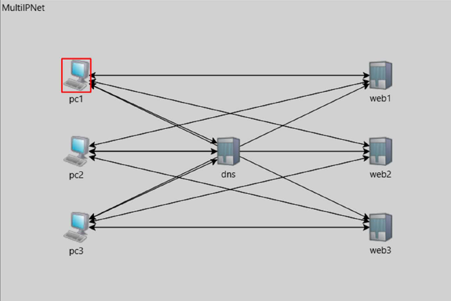

# Health-Aware Multi-IP HTTP Failover System

## Overview

This project implements an intelligent, self-healing web infrastructure that automatically routes user requests to the healthiest available servers. By combining health-aware DNS resolution, intelligent client behavior, and proactive monitoring, the system maintains high availability and optimal performance even during partial server failures.

## Traditional vs What New

Traditional web infrastructure relies on reactive failure detection, meaning users experience service degradation before issues are identified. This system transforms web reliability by implementing **proactive health monitoring** and **cross-layer protocol intelligence** to prevent failures before they impact users. The innovation lies in breaking conventional protocol layer boundaries, allowing application-layer health metrics to inform both transport and network-layer decisions.

## Functions

### 1. Health-Aware DNS Server
- **Real-time Server Monitoring**: Continuously tracks server health metrics including response times and success rates
- **Dynamic IP Resolution**: Returns only addresses of servers currently functioning properly
- **Multi-Domain Support**: Handles three distinct service domains with specialized routing strategies:
  - `api.example.com` — API and dynamic data services
  - `static.example.com` — Static content delivery
  - `video.example.com` — Video streaming and media content

### 2. Intelligent HTTP Clients
- **Adaptive Learning**: Clients learn optimal response timeouts through experience, reducing timeouts from 2.4s to 0.9s
- **Context-Aware Memory**: Maintains knowledge of which servers perform best for specific content types
- **Smart Failover**: Implements exponential backoff and graceful retry mechanisms
- **Performance Tracking**: Continuously optimizes server selection based on historical interactions

### 3. Load Balancing Strategies
The system deploys three complementary algorithms based on content requirements:
- **Response-Time Optimization** (Dynamic content): Routes to fastest-responding servers
- **Weighted Reliability** (Static content): Prioritizes server stability over speed
- **Round-Robin Distribution** (Streaming): Ensures balanced capacity utilization

### 4. Proactive Health Monitoring
- **Continuous Probes**: Automated health checks every 15 seconds detect problems before user impact
- **Circuit Breaker Pattern**: Automatically isolates repeatedly failing servers after 3 consecutive failures
- **Automatic Recovery**: Monitors and reintegrates recovered servers with verification
- **Server Status Tracking**: Maintains states (Healthy, Degraded, Unhealthy)

## System Diagrams

**System Architecture** — Three client systems communicate through a health-aware DNS server that manages traffic distribution to three backend web servers. Solid arrows show HTTP request flows, while dashed lines represent continuous health monitoring probes that feed real-time server metrics back to the DNS system.

**Cross-Layer Integration** — The system violates traditional OSI layer isolation by allowing application-layer data (response times and health metrics) to inform transport-layer timeout behavior and network-layer routing decisions. Session-layer client memory further guides application-level request distribution for contextual optimization.

**Failover Workflow** — When a server becomes unresponsive, the health monitor detects the failure within 15 seconds, triggers a circuit breaker to isolate the server, and updates DNS responses to exclude it. Clients receive only healthy server addresses and are seamlessly redirected. The system continuously monitors for recovery and gradually reintegrates the server once stability is verified.

## Key Problems Solved

| Problem | Solution |
|---------|----------|
| **Blind DNS** — DNS returns addresses regardless of server status | Health-aware DNS that excludes failed servers from responses |
| **Inflexible Clients** — Clients lack learning and adaptability | Intelligent clients that remember successful servers and adjust timeouts |
| **Generic Routing** — All requests treated identically | Context-aware routing optimized for content type |
| **Reactive Detection** — Problems detected after user complaints | Proactive monitoring that identifies issues before impact |
| **Cascading Failures** — One server failure can overwhelm others | Circuit breaker mechanism that prevents overload propagation |
| **Static Configuration** — Manual setup for each service | Dynamic domain-specific strategy selection |

## Technical Architecture

### Cross-Layer Integration
The system violates traditional OSI layer isolation for performance gains:

- **Application → Transport Layer**: HTTP response times influence TCP-like timeout values
- **Application → Network Layer**: Health metrics drive DNS routing decisions
- **Session → Application Layer**: Client session history guides intelligent request distribution

### Implementation Scope
- **3 Backend HTTP Servers** with dynamic failure simulation
- **3 Intelligent Client Systems** with learning capabilities
- **1 Enhanced DNS Server** with real-time health monitoring
- **4 OSI Layers** involved (Application, Session, Transport, Network)
- **Multi-domain Configuration** with specialized strategies

## Key Features

1. Real-time health monitoring and metrics collection  
2. Multiple load balancing algorithms (Round Robin, Weighted, Response Time)  
3. Circuit breaker pattern for failure isolation  
4. Adaptive client behavior with machine learning principles  
5. Comprehensive logging and dashboard system  
6. Automatic failure detection and transparent recovery  
7. Context-aware, content-type-optimized routing  
8. Distributed intelligence (server-side and client-side)  

## Unique Innovations

Unlike conventional load balancers, this system introduces:

1. **Collaborative Intelligence**: Both DNS servers and clients contribute to failure handling
2. **Content-Type Awareness**: Routing strategies automatically adapted to content requirements
3. **Preventive Architecture**: Health checks prevent failures rather than recovering from them
4. **Self-Adaptive Learning**: Clients continuously optimize behavior without manual configuration
5. **Cross-Layer Optimization**: Application metrics directly influence lower-layer protocol behavior

## Results

- Server failures detected and isolated within 15 seconds
- Automatic traffic redirection without user-visible errors
- Client timeout optimization reduces latency through experience
- Cascading failures prevented through circuit breaker mechanism
- Multi-domain routing executes specialized strategies automatically

## Technology Stack

- **Simulation Framework**: OMNeT++ Discrete Event Simulator

